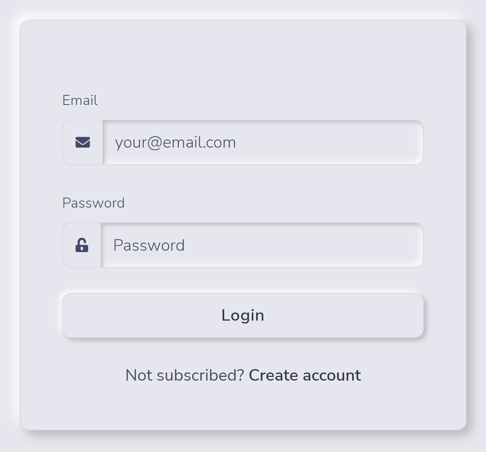
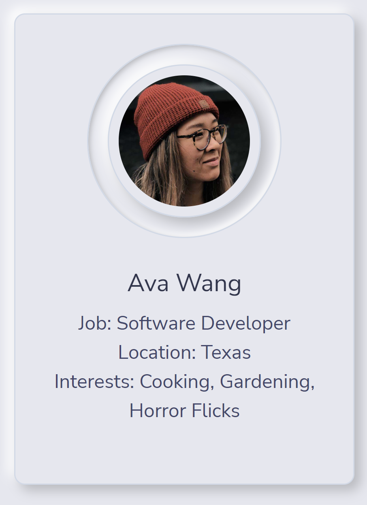
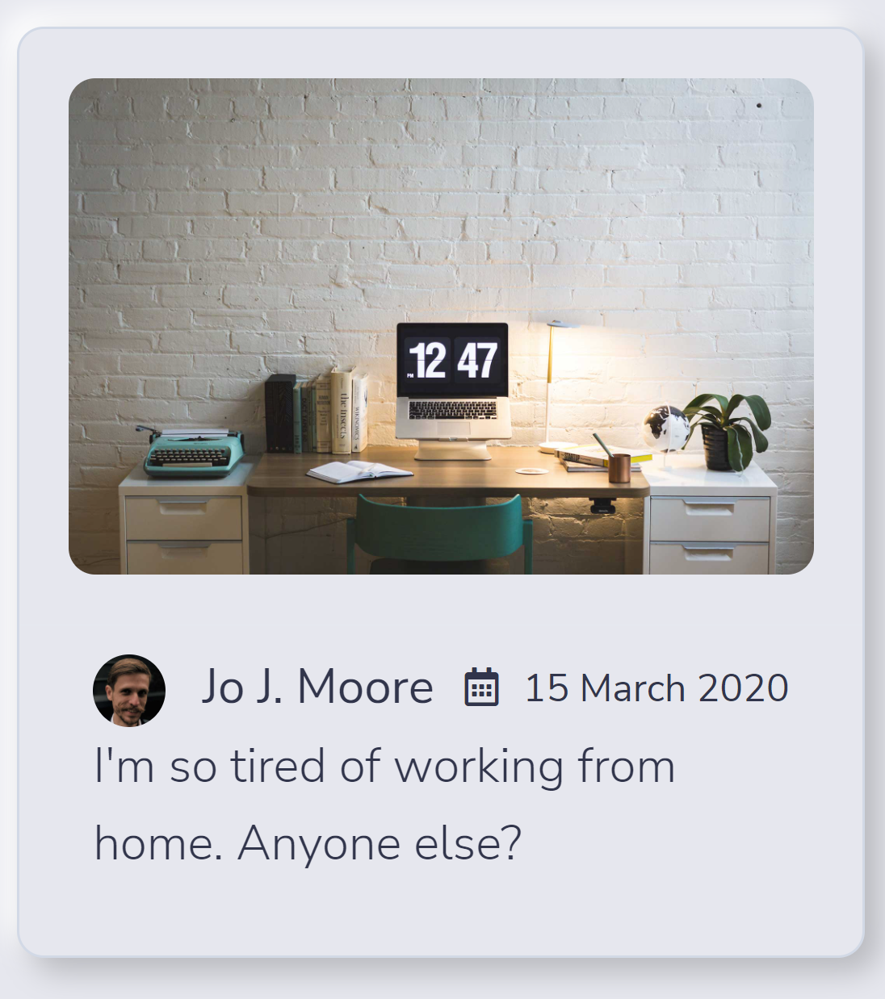
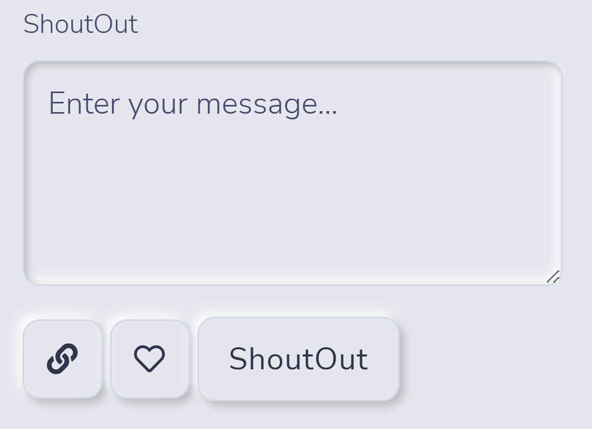

# [Chit Chat](#title)

## [Description](#description)
Chit Chat is a mobile-responsive, social media platform on which users can post messages, pictures, and videos - known as "Shout Outs". Anyone can view Shout Outs, including unregistered users, but only registered users can create, update, and delete them. Additionally, registered users add comments and like/dislike content shared by other users.

## Table of Contents
> - [Title](#title)
> - [Description](#description)
> - [Developers](#developer)
> - [Packages & Libraries](#resources)
> - [Tech Stack](#stack)
> - [Wireframe](#wireframe)
> - [Minimum Viable Product](#MVP)

## Developers
1. Maria Jayakumar
2. Chance Telford
3. Jamie Jackson
4. Brad Kelley

## [Packages & Libraries](#resources)
The following resources were used in the development of this project.
> - Bcrypt (version 5.0.1);
> - Bootstrap (version 5.1.3);
> - Connect Session Sequelize (version 7.1.2);
> - Dotenv (version 16.0.0);
> - Express (version 4.17.3);
> - Express Handlebars (version 6.0.2);
> - Express Session (version 1.17.2);
> - Handlebars (version 4.7.7);
> - Multer (version 1.4.4);
> - MySQL Server (version 8.0.28);
> - MySQL2 (version 2.3.3); and
> - Sequelize (version 6.16.3)

## [Tech Stack](#stack)
> - HTML 5
> - JavaScript
> - CSS

## [Wireframe](#wireframe)
### User Login

### User Profile

### ShoutOut - Read

### ShoutOut – Create

## [Minimum Viable Product](#MVP)
The MVP for the proposed application is as follows:

**View ShoutOuts and Comments**
1. When the user connects to the application’s URL, then the user is presented with the **Chat Board**; which contains ShoutOuts and related comments.
2. When a user clicks on a ShoutOut, then the user is redirected to a screen and presented with the original ShoutOut and all related comments.
>>> **Note: All users can Read ShoutOuts and comments, but only logged-in users can create, update, and delete content.**

**Create an Account & Login**
3. When the user clicks on the **Login** hyperlink in the upper right corner of the viewable screen, then the user is presented with an application **login form** that includes a link to **create an account**.
4. When the user clicks on the **create an account** link, then the user is presented a **user profile form** that includes the user’s first and last name, address, email, and password.
5. When the user has successfully completed the **create an account** form and clicks the **Register button**, then the user provided information is validated; if the information provided passes the validation checks, an account is created and the application returns the user to the **login form**; else the application provide an error message.
6. When the user enters a registered **email address** and **user name** into the **login form** and clicks the **login button**, then the application verifies the user’s credentials; if the user has valid credentials, the application will (1. Issue a cookie to the user’s browser, (2. Log the user’s session in the application’s database, and (3. Redirect the user to the **Chat Board**.

**Create a ShoutOut**
7. When a user clicks on the **ShoutOut icon**, then the user is redirected to a screen with (1. a textarea to enter a message, and (2. **add media file icon** used to add an image or video.
8. When the user clicks the **add media file icon**, then the user is presented with a modal-like feature that allows her/him to browse, select a file, and upload the file.
9. When the user clicks the **ShoutOut button**, then the text is stored in the message is stored in the database and made visible on the **Chat Board**.

**Create a Comment**
10. When a user clicks on the **Comment icon**, then the user is redirected to a screen with (1. a textarea to enter a message, and (2. **add media file icon** used to add an image or video.
11. When the user clicks the **add media file icon**, then the user is presented with a modal-like feature that allows her/him to browse, select a file, and upload the file.
12. When the user clicks the **Comment button**, then the text is stored in the message is stored in the database and made visible on the **Chat Board**. Comments are nested in a ShoutOut.

**Update a ShoutOut or Comment**
13. When the originator of a ShoutOut or Comment clicks the **edit icon**, then the user is allowed to modify the current text and/or media content, and save the new version.

**Delete a ShoutOut or Comment**
14. When the originator of a ShoutOut or Comment clicks the **delete icon**, then the user is allowed to delete the record.

## Stretch Goals
Project stretch goals include incorporating the following non-prioritized features:
1. User can create personal groups;
2. User can ShoutOut to personal groups;
3. Separate user profiles for people and companies;
